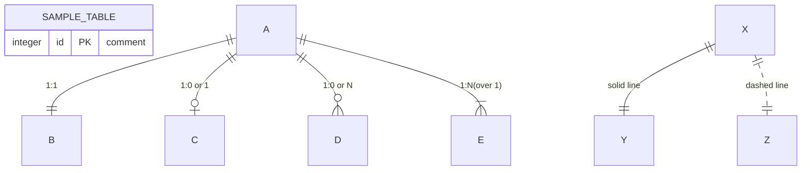

```mermaid
erDiagram
    %% describe
    SAMPLE_TABLE {
        integer id PK "comment"
    }

    %% relationship
    A ||--|| B : "1:1"
    A ||--o| C : "1:0 or 1"
    A ||--o{ D : "1:0 or N"
    A ||--|{ E : "1:N(over 1)"

    %% line
    X ||--|| Y : "solid line"
    X ||..|| Z : "dashed line"
```