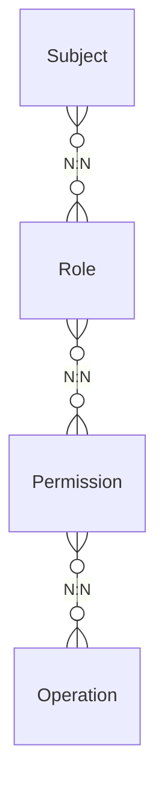

# RBAC

RBAC=Role Base Access Control
業務システムにおける権限制御のためのデータモデルパターンのひとつ

### 構成要素

- Subject：権限の被付与対象、複数のRole(役割)を持てる。
- Role：Permission(権限)のセット。
- Permission：許可されるOperation（操作）のセット。
- Operation：操作

### アンチパターン

#### 組織=ロール
組織は頻繁に変更される（粒度や対応業務など）ために、現実の組織変更に合わせて複雑で無駄なデータメンテナンスが都度発生して運用コストがバカにならない。また設定ミスによるセキュリティリスク等も内在。

#### ロール=権限
現実の業務要件（権限のコントロール単位）を正確に見出せておらず、権限が膨大となり、集合として管理できないために把握困難性、さらにテスト困難性を内在。

#### 権限 = オペレーション
現実的には参照・更新（またその種類）等一つの権限が複数の操作を許可・不許可にしたいケースが多い。操作も実際に業務単位に合わせて適切に権限として集合管理すべき。

### 参考

[業務システムにおけるロールベースアクセス制御](https://qiita.com/kawasima/items/8dd7eda743f2fdcad78e)